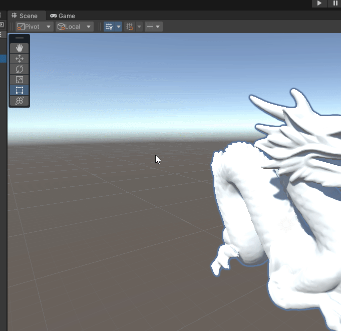

# UnityBlenderDecimate

#### Unity sample: decimate obj model in blender

### Installation:
- Install unitypackage from releases

### Basic usage:
- Open window by path "Tools/Unity To Blender"
- Select Blender executable path (Mac: check app in Application path. Need correct name - Blender)
- Select python script and OBJ
- Run!
